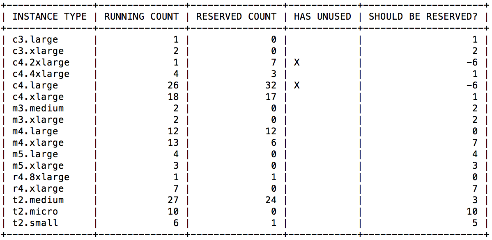
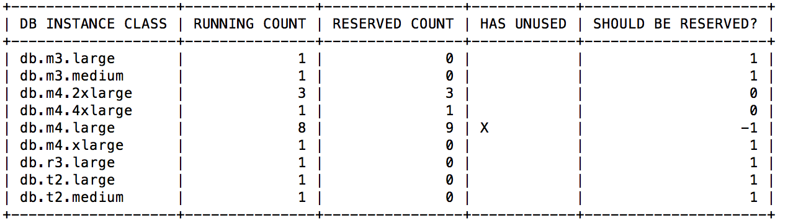

# aws

AWS golang pkg, binaries, utils, etc.

## Reservation Audits

Occasionally, you might find yourself wanting to quickly audit reservations
that you've purchased, making sure you are using all of your reserved instances,
or maybe finding out how many more you need to reserve. You can use the
following commands found in the `cmd` folder for just that purpose.

### reserved-instance-audit

Audits your reserved EC2 instances against your currently running ones.

### reserved-rds-audit

Audits your reserved RDS instances against your currently running ones.

