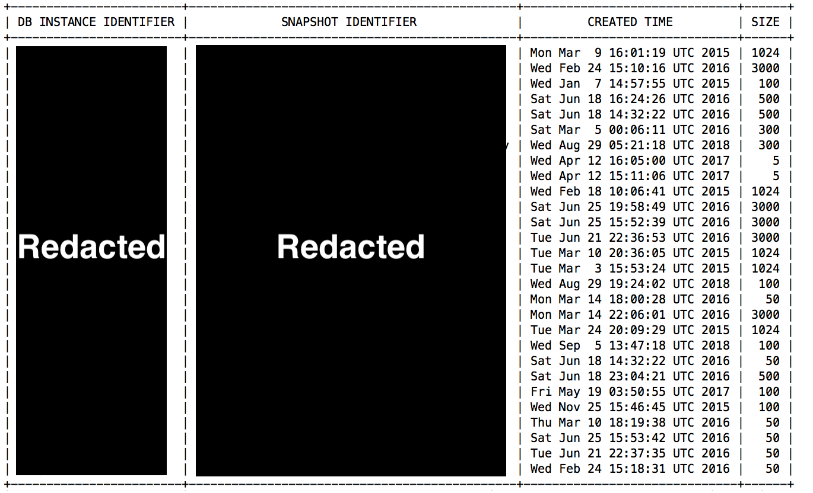
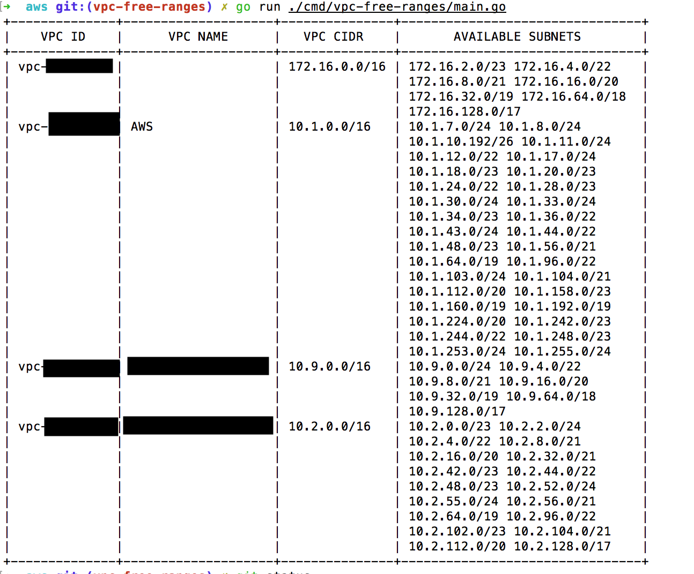

# aws

[](https://travis-ci.org/jonstacks/aws)

AWS golang pkg, binaries, utils, etc.

<!-- TOC depthFrom:2 depthTo:6 orderedList:false updateOnSave:true -->

- [Install](#install)
- [Reservation Audits](#reservation-audits)
    - [reserved-instance-audit](#reserved-instance-audit)
    - [reserved-rds-audit](#reserved-rds-audit)
- [Auditing EC2 Instances](#auditing-ec2-instances)
    - [instances-without-cost-tag](#instances-without-cost-tag)
- [Auditing RDS Snapshots](#auditing-rds-snapshots)
- [Finding available subnet space in a VPC](#finding-available-subnet-space-in-a-vpc)
- [Getting a download URL for your RDS logs](#getting-a-download-url-for-your-rds-logs)
- [Sync RDS logs to a local directory](#sync-rds-logs-to-a-local-directory)
- [Getting the IP of an EC2 Instance from the Spot Instance Request ID](#getting-the-ip-of-an-ec2-instance-from-the-spot-instance-request-id)

<!-- /TOC -->

## Install

You can install most simply by using `go get`:

```
go get -u github.com/jonstacks/aws/cmd/...
```

## Reservation Audits

Occasionally, you might find yourself wanting to quickly audit reservations
that you've purchased, making sure you are using all of your reserved instances,
or maybe finding out how many more you need to reserve. You can use the
following commands found in the `cmd` folder for just that purpose.

### reserved-instance-audit

Audits your reserved EC2 instances against your currently running ones.


Options:

* `--only-unmatched`: Show only instance types that are not perfectly reserved.

### reserved-rds-audit

Audits your reserved RDS instances against your currently running ones.


## Auditing EC2 Instances

You might want to audit your existing EC2 Instances to make sure they meet
certain criteria.

### instances-without-cost-tag

The `instances-without-cost-tag` command finds running instances that do not
contain a non-empty `cost` tag. This is helpful for making sure all instances
are accounted for on an internal bill back basis.

## Auditing RDS Snapshots

The `rds-snapshot-audit` command gets a list of running DB instances and a
list of rds snapshots. It then compares the both lists to find snapshots whose
identifier no longer exists in the running DB instances. While not always the
case, there is a chance that these snapshots are no longer needed and can be
cleaned up to save you money. At the time of this writing, the cost for
`RDS:ChargedBackupUsage` is $0.095/(GB*Month) of storage. That means a 3 TB
DB that is no longer around that still has a snapshot *could* be costing you
$285/month or $3,420/year. If your bill has a `RDS:ChargedBackupUsage` then
this tool might be for you.



## Finding available subnet space in a VPC

When you want to create a new subnet, it can be difficult to see all of the
ranges that are available to you in the console. This utility shows you the
largest contiguous subnet space available to you in your VPC.



## Getting a download URL for your RDS logs

It appears that both the `awscli` and sdk libraries are broken for downloading
RDS logs. I have experienced this grief as well. So, I have made a program
based on the git issues below that will give you a download link to download
the complete logs:

* https://github.com/aws/aws-cli/issues/2268
* https://github.com/aws/aws-cli/issues/3079

You can install it with:

```
go get -u github.com/jonstacks/aws/cmd/rds-logs-download-url
```

Along with a program like `curl` you can have a complete solution to
downloading your RDS logs like so:

```sh
#!/bin/bash

set -e

# This program requires that you supply these AWS environment variables.
# Can possibly pull this out of an AWS config in the future.
export AWS_DEFAULT_REGION="us-west-2"
export AWS_ACCESS_KEY_ID=""
export AWS_SECRET_ACCESS_KEY=""

# Change the following 2 environment variables to the specific values
# for your DB instance and the log name
export DB_IDENTIFIER="fc16fu3t5aah9e9"
export LOG_NAME="error/postgresql.log.2018-04-08-15"

LOG_URL=$(rds-logs-download-url $DB_IDENTIFIER $LOG_NAME)
# -s for silent, -f for fail so we can retry on failure
curl -sf -o $(basename $LOG_NAME) $LOG_URL
```

*Note*: I have only really tested this against the `us-west-2` region. It might
        need some additional changes to support others use cases.

## Sync RDS logs to a local directory

Similar to the above command for getting a download URL for a given log and DB
instance identifier, this command will sync all logs for a given DB instance
identifier to a given local directory. This can be useful to run on a cron for
syncing logs to a directory, so applications like pgbadger can process them.

You can install it with:

```
go get -u github.com/jonstacks/aws/cmd/sync-rds-logs
```

The usage is as follows:

```
Usage:
  sync-rds-logs <dbInstanceIdentifier> <directory>

Example:
  sync-rds-logs some-identifier /my/log/directory
```


## Getting the IP of an EC2 Instance from the Spot Instance Request ID

To easily get the internal IP address of an instance given the spot
instance request id, you can run the following:

```
spot-instance-ip sir-kd4rbkim sir-cmd8atam ...
```

And the output:

```
10.1.132.15
10.1.136.232
```